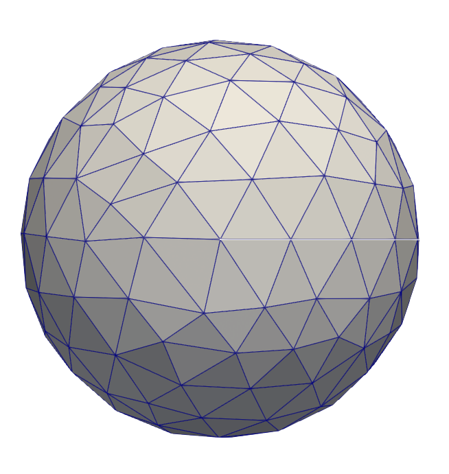
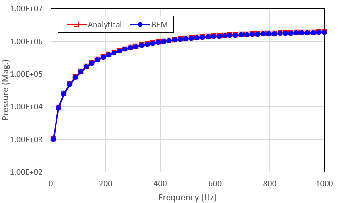

# Monopole (spherical radiator) power

## Theory

For a rigid sphere with a uniform, harmonic surface normal velocity $`v_0`$, the power radiated by the sphere is (Cremer and Heckl, Eq. 7.19): 

```math
W = \frac{1}{2} \int _S \text{Re} (p^*v_n)dS = 2 \pi a^2 \| v_0 \|^2 \rho c \frac{(ka)^2}{1+(ka)^2}
```
where 
* $`a`$ is the radius of the sphere
* $`k`$ is the wavenumber, equal to $`\omega / c`$ where $`\omega`$ is the angular frequency and $`c`$ is the fluid speed of sound
* $`\rho`$ is the fluid mass density

## Example problem

A problem with the following parameters was simulated:

* $`a = 0.5`$
* $`v_0 = 1.0 + 0.0i`$
* $`c = 1500`$, $`\rho = 1000`$
* Frequency ranging from $`f = 10.0`$ Hz to $`f = 1000.0`$ Hz ($`k \in [4.19\times10^{-2}, 4.19\times10^0]`$)

For the BEM results, a spherical mesh of 336 triangular elements was used



Results are shown below with good agreement.




## References

* Cremer, L., & Heckl, M. (2005). *Structure-borne sound: structural vibrations and sound radiation at audio frequencies*. Springer Science & Business Media.