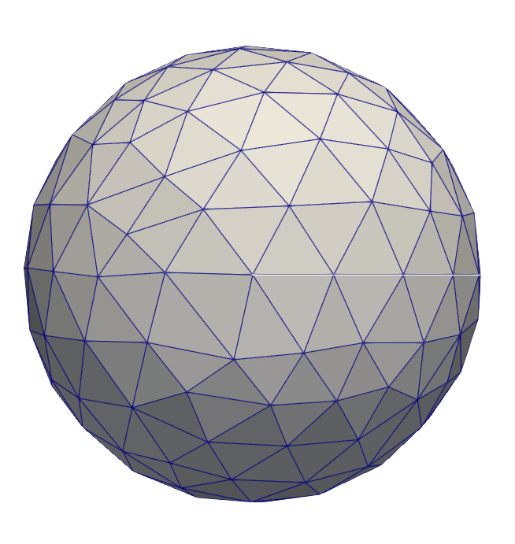

# Plane wave scattering by a rigid sphere

## Theory

For a rigid sphere (i.e., total normal velocity on the surface is zero), the analytical result for the scattered pressure field at any point $`(r, \theta)`$ outside of the sphere is

```math
p_s(r, \theta) = p_i \sum_{n=0}^\infty (2n+1)i^n P_n(\cos \theta) \frac{j_n'(kR)}{h_n'(kR)}h_n(kr)
```
where 
* $`R`$ is the radius of the sphere
* $`p_i`$ is the complex amplitude of the plane wave
* $`k`$ is the wavenumber, equal to $`\omega / c`$ where $`\omega`$ is the angular frequency and $`c`$ is the fluid speed of sound

## Example problem

A problem with the following parameters was simulated:

* $`R = 0.5`$
* $`p_i = 1.0 + 0.0i`$
* $`c = 1500`$
* Frequency ranging from $`f = 10.0`$ Hz to $`f = 1000.0`$ Hz ($`k \in [4.19\times10^{-2}, 4.19\times10^0]`$)

For the analytical results, 80 terms were used in the summations.

For the BEM results, a spherical mesh of 336 triangular elements was used



Field pressures were evaluated in the shadow zone of the plane wave, i.e., $`\theta = 0`$ at a radius of $`R = 10`$.

## References

* Partridge, C. J. (1993). Sound wave scattering from a rigid sphere. Materials Research Laboratory.